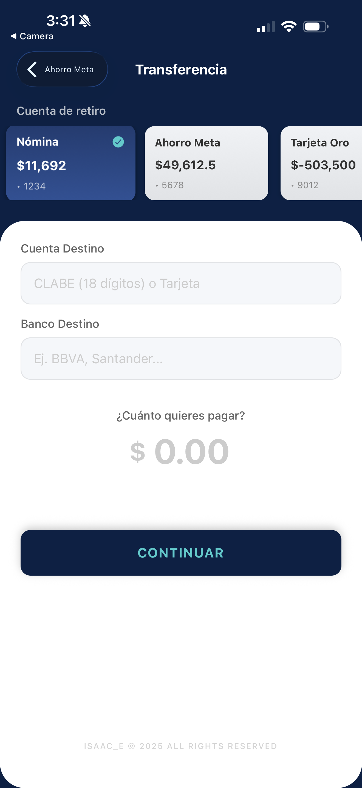
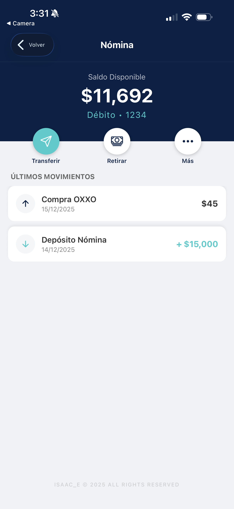
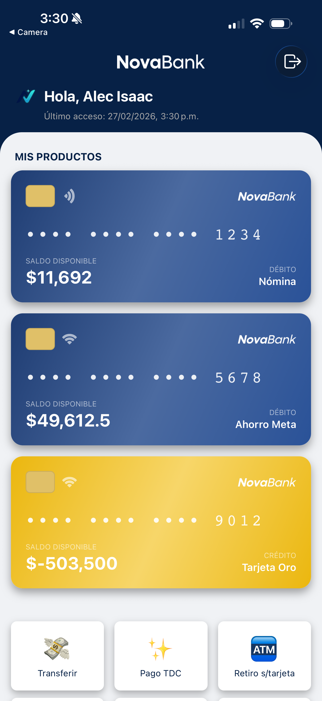

# 🏦 NovaBank

High-fidelity fintech mobile prototype built with **React Native +
Expo**.

NovaBank simulates a modern digital banking experience, focusing on
structured global state management, financial business logic validation,
and scalable mobile architecture patterns.

<p align="center">
  
  
</p>

---

## 🚀 Tech Stack

- React Native\
- Expo SDK 52\
- TypeScript\
- Expo Router (Stack Navigation)\
- React Context API (Global State Management)\
- React Native Maps (Google Maps Provider)\
- Animated API\
- Linear Gradient\
- Native Modals

---

## 🧠 Architecture Overview

NovaBank uses centralized global state powered by React Context API to
manage:

- Account balances\
- Transaction history\
- Card lock state\
- Authentication session state

Financial operations trigger controlled state mutations, ensuring:

- Immediate UI updates\
- Consistent balance recalculations\
- Validation against insufficient funds\
- Deterministic transaction injection into history

Navigation is handled via Expo Router using stack-based routing.

---

## ✨ Core Features

### 🔐 Simulated Biometric Authentication

- FaceID-style animated login\
- Persistent last access timestamp\
- Controlled session state

### 💳 Real-Time Account Management

- Live dashboard with instant balance updates\
- Credit card lock toggle with persistent UI state\
- Dynamic transaction history (FlatList)

### 💰 Financial Operations Logic

- Credit card payment calculation logic\
- Cardless withdrawal temporary code generation\
- Business rules preventing invalid transfers

### 🗺 Geolocation Integration

- Interactive map view with custom branded markers\
- Styled pin components (CSS-in-JS)

---

## 📂 Project Structure

    app/        → Screens and navigation (Expo Router)
    components/ → Reusable UI components
    context/    → Global state management
    hooks/      → Custom logic hooks
    constants/  → Static configuration values
    assets/     → Images and UI assets
    docs/       → Screenshots and documentation

---

## 🛠 Getting Started

### Install dependencies

```bash
npm install
```

### Run the project

```bash
npx expo start
```

Scan the QR code using **Expo Go**.

---

## ⚠️ Disclaimer

This is a simulated fintech environment built for demonstration
purposes.\
No real banking APIs or financial services are integrated.

---

## 📸 Additional Screenshots

<p align="center">
  
  
</p>
